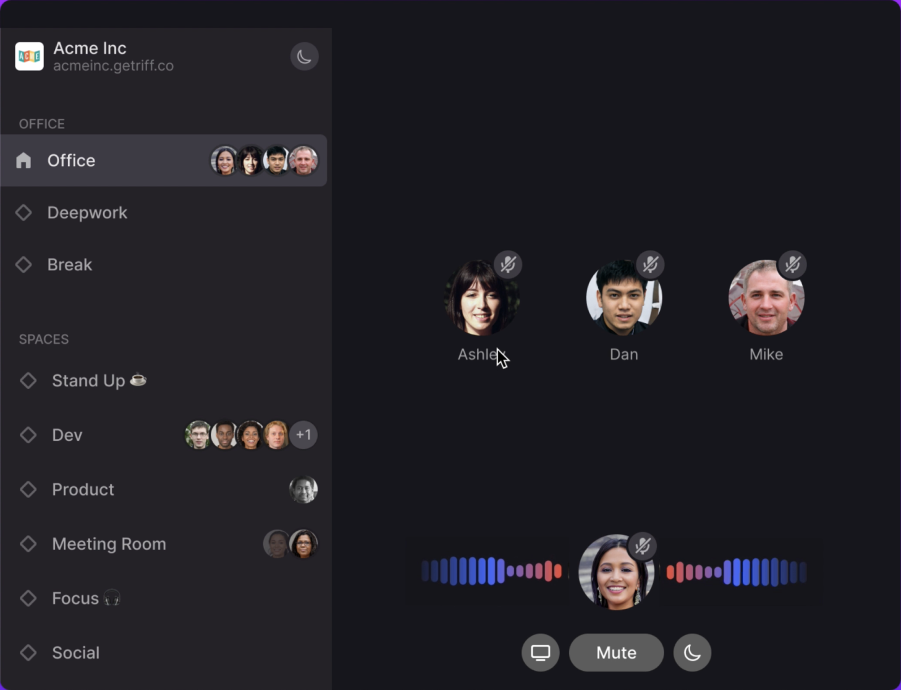

# Changes after webflow code export

1. Copy out css styles below to the file `css/riff-399b8a-06efe44aceb78-e38a1ce0b6026.webflow.css`

```
.video {
	width: 100%;
	max-width: 729px;
	margin: 80px;
	border-radius: 16px;
	box-shadow: 0 20px 40px 0 rgba(0, 0, 0, 0.45);
}

@media screen and (max-width: 991px) {
	.video {
		width: 69%;
		max-width: 729px;
		margin: 80px;
		border-radius: 16px;
		box-shadow: 0 20px 40px 0 rgba(0, 0, 0, 0.45);
	}
}

@media screen and (max-width: 767px) {
	.video {
		width: 100%;
		max-width: none;
		margin-top: 32px;
		margin-bottom: 32px;
		border-radius: 10px;
	}
}

@media only screen and (min-width: 1441px) {
	.img-wrapper {
		border-radius: 10px;
		padding-left: 80px;
		padding-right: 80px;
	}

	.img-wrapper-reverse {
		border-radius: 10px;
		padding-left: 80px;
		padding-right: 80px;
	}

	.image-2 {
		margin-right: 0px;
		margin-left: 0px;
	}

	.video {
		margin-right: 0px;
		margin-left: 0px;
	}
}
```

2. Copy videos and fallback images from `videos.zip` to web folder `/images`

3. Replaces product images with videos in index.html file

- there are 4 videos on the web
  replace

```

<div class="img-wrapper">
	
</div>
```

with

```

<div class="img-wrapper">
    <video class="video img-vid-parallax" playsinline autoplay loop muted>
        <source src="images/videos/Riff_Video_01.mp4" type="video/mp4" />
          tag" />
    </video>
</div>
```

- if you are not sure get inspired by what is on production.
- dont forget to name videos and fallback images properly. (Riff_Video_01, Riff_Video_02, Riff_Video_03 ....)
